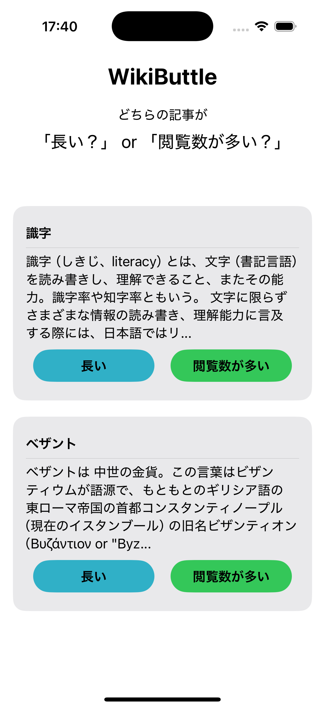
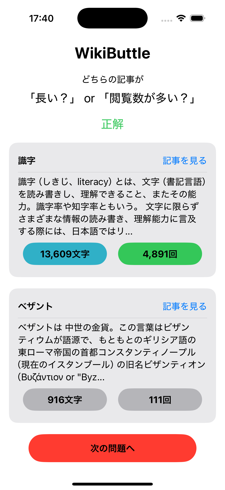
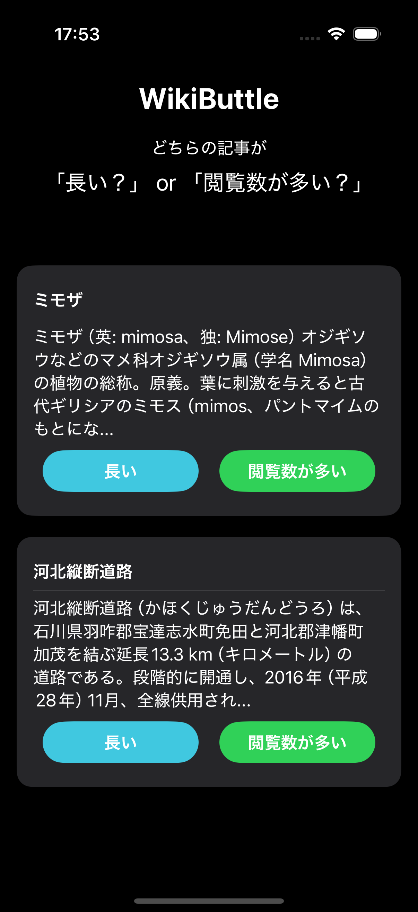
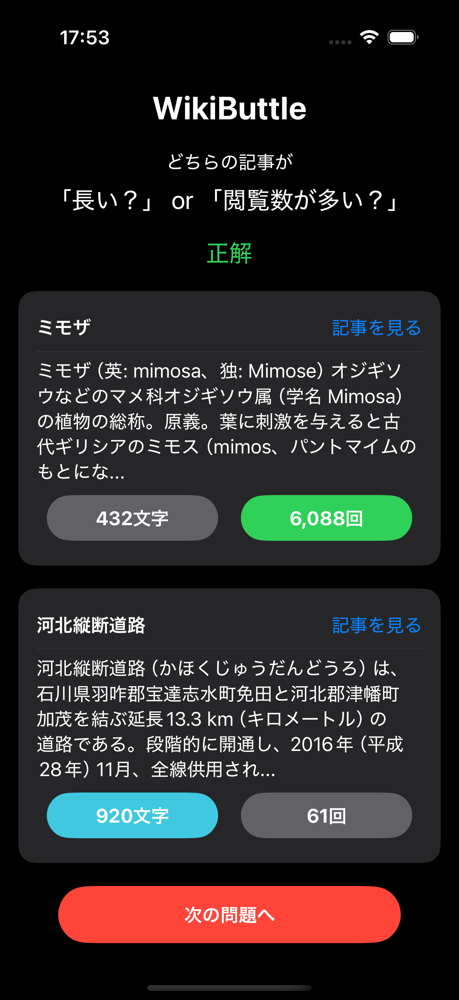

# WikiBattle

## アプリケーションの概要

異なる2つのWikipediaの記事のタイトルと冒頭の文章だけを見比べて，
どちらの記事が「文字数が多い」あるいは「多く閲覧されている」かを当てるクイズゲーム．
元ネタは[WikiArena](https://store.steampowered.com/app/2090700/WikiArena/?l=japanese)というゲーム．

このゲームは，自分の持っている背景知識を頼りに推察する能力を鍛えられたり，
普段調べる機会のない単語を知ることができたりするため，遊べば遊ぶほど博識になれるだろう．

### 遊び方

アプリを開くと2つの記事がランダムに取得され，その記事のタイトルと冒頭の100文字
が画面上に表示される．
ユーザは，タイトル・冒頭の文章の情報を頼りにして「文字数が多い記事」か「(過去60日間で)多く閲覧されている記事」
のどちらかを回答する．つまり，1問の選択肢は4つあり，正解は2つある．

<!-- <)>
<)> -->

  <kbd></kbd>
  &nbsp;&nbsp;&nbsp;&nbsp;
  <kbd></kbd>

いずれかのボタンをタップすると，それぞれの記事の文字数・閲覧数が表示され，正解・不正解の判定が表示される．
また，記事のタイトルの横に「記事を見る」ボタンが表示され，これをタップするとアプリ内ブラウザで
その記事を開くことができる．
画面下部に表示される「次の問題へ」をタップすれば再び2つの記事がランダムに取得され，次の問題が出題される．

## 技術スタック

- 言語：Swift
- フレームワーク：SwiftUI, SafariServices
- API：Media Wiki API

## 工夫した点

### MVVMアーキテクチャの利用

Model・View・ViewModelに独立させて実装した．これにより，以下のメリットを得られた：

- UIロジックとデータ処理を分離しすることで，コードの見通しが良くなった
- コンポーネントの再利用が容易になり，新機能の追加や仕様変更にも対応しやすくなった

### 分かりやすいフォルダ構成

MVVMアーキテクチャを導入したので，フォルダ構成も`Models`・`Views`・`ViewModels`で分割して管理することで，
ファイルの位置を明確にして，開発時の可読性を向上させた．

### コンポーネントの分割

このアプリでは2つの記事を表示しているが，それぞれの記事を表示するUIは同じものであるため
これを繰り返し記述するのはコードが煩雑になる．
そこで，各記事のViewを`ArticleView`として全体的なViewを記述している`ContentView`と分割することで，
コードの可読性が向上し，修正が容易になった．
同様に，ボタンは`ButtonView`，ブラウザの表示は`SafariView` のように分割している．

### ブランチ管理

個人開発で小規模なアプリであるため，今回はGitHub Flowを採用した．これにより，以下のメリットを得られた：

- `feature/XXX`のように機能ごとにブランチを分けることで，1つの機能に集中しやすくなった
- mainブランチは動作確認が完了したものだけをマージすることで安定した状態を維持できるようになった
- 開発の進捗管理がしやすくなった

### ライト・ダークモード両対応

どちらの表示に設定していたとしても，問題なく画面表示が行えるように工夫した．

  

    <kbd></kbd>
    &nbsp;&nbsp;&nbsp;&nbsp;
    <kbd></kbd>
  
 

### 問題として不適切なものを防ぐ機能を導入

ランダムで記事を取得しているため，以下のような不適切な問題を排除する仕組みを導入した：
- 文字数が100文字未満で即答できてしまう記事
- 文字数・閲覧数が完全に一致して引き分けになるケース

このような記事が取得された場合は，新たに記事を取得する仕様にしている．

### 出題された記事を閲覧できる機能を導入

実際に出題された記事の内容が気になった人のために，答えを表示した後に簡単に記事にアクセスすることができる
「記事を見る」ボタンをを導入した．これにより，わざわざ「タイトルを覚えてブラウザで検索する」
という手間を省き，ユーザビリティを向上させることができた．

## 今後の改善点

目的としていた機能は実装できたが，アプリをより良くしていくために以下のような改善を続けていきたい：

- 多言語対応
  - 現在は日本語の記事のみに対応しているので，設定で他の言語を選択できるようにしたい
- よりゲーム性を持たせる
  - 現在は「出題」→「回答」→「次の出題」を繰り返すだけなので，連続正解数の目標やHP(間違えて良い回数)を設けることで
    ゲームとして「かけひき」を行えるようにしたい
- ランキング機能
  - ユーザ登録機能を実装して，連続正解数を他のユーザと競える機能を追加したい
- アプリのリリース
  - 実際にリリース作業を経験し，他のユーザからのフィードバックをもらいたい
